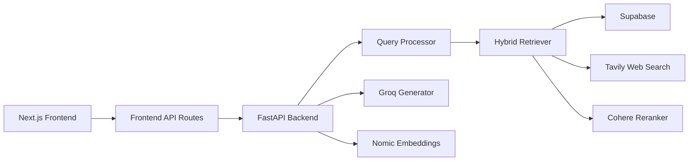

# KeralaGPT

KeralaGPT is a cultural intelligence platform for exploring Kerala's history, arts, literature, rituals, cuisine, cinema, and geography through a modern AI interface.

It combines a curated knowledge base, hybrid retrieval, streaming responses, source-aware answers, and community contribution workflows to make regional knowledge searchable, explainable, and expandable.

## Why This Project Exists

Much of Kerala's cultural knowledge lives across scattered archives, oral traditions, academic texts, local expertise, and fragmented web sources. KeralaGPT brings that material into one product experience that feels accessible to students, researchers, diaspora communities, travelers, and cultural institutions.

The current platform is built around:

- A conversational research interface
- Eight structured cultural domains
- Retrieval-augmented generation with citations
- Community knowledge submission and moderation
- A foundation for a durable, growing Kerala knowledge graph

## Experience

KeralaGPT ships with a multi-surface product flow:

- `Chat`: ask domain-aware questions and receive streaming answers with supporting sources
- `Explore`: browse the knowledge base by domain and jump into suggested prompts
- `Contribute`: submit new cultural knowledge for review and ingestion
- `Admin`: review contributions, inspect feedback, and view knowledge base stats

The seeded domain model currently covers:

- Performing Arts
- Classical Literature
- History and Heritage
- Temple Architecture
- Festivals and Rituals
- Cuisine
- Malayalam Cinema
- Geography and Nature

## Core Capabilities

- Hybrid retrieval pipeline for curated knowledge plus optional web support
- Query processing for domain routing, conversational detection, and query expansion
- Streaming answer generation over Server-Sent Events
- Source panels with credibility tiers and metadata
- Supabase-backed storage for documents, contributions, and application data
- Bulk seeding and ingestion scripts for growing the knowledge base

## Architecture



## Tech Stack

**Frontend**

- Next.js 16
- React 19
- TypeScript
- Zustand
- Tailwind CSS 4

**Backend**

- FastAPI
- Python
- Supabase
- Groq
- Nomic embeddings
- Cohere reranking
- Tavily web search

## Repository Layout

```text
keralagpt/
|- frontend/              # Next.js app and frontend API routes
|- backend/               # FastAPI app, RAG services, routers, scripts
|  |- app/
|  |  |- routers/         # chat, retrieval, domains, contribute, feedback
|  |  |- services/        # db, ingestion, rag
|  |- scripts/            # seeding and ingestion utilities
|  |- requirements.txt
|- README.md
```

## Local Setup

### 1. Clone and install

```bash
git clone <your-repo-url>
cd keralagpt
```

### 2. Backend setup

```bash
cd backend
python -m venv .venv
.venv\Scripts\activate
pip install -r requirements.txt
```

Create `backend/.env` with:

```env
SUPABASE_URL=
SUPABASE_KEY=
SUPABASE_SERVICE_KEY=
GROQ_API_KEY=
NOMIC_API_KEY=
NOMIC_EMBED_URL=https://api-atlas.nomic.ai/v1/embedding/text
FRONTEND_URL=http://localhost:3000
TAVILY_API_KEY=
COHERE_API_KEY=
SUPABASE_HTTP_TIMEOUT=30
```

Run the backend:

```bash
uvicorn app.main:app --reload --port 8000
```

### 3. Frontend setup

```bash
cd frontend
npm install
```

Create `frontend/.env.local` with:

```env
FASTAPI_URL=http://localhost:8000
```

Run the frontend:

```bash
npm run dev
```

Frontend: `http://localhost:3000`  
Backend: `http://localhost:8000`  
API docs: `http://localhost:8000/docs`

## Data and Ingestion

The backend includes scripts and SQL helpers for initializing and growing the knowledge base:

- `backend/supabase_setup.sql`
- `backend/supabase_fix.sql`
- `backend/scripts/ingest_cli.py`
- `backend/scripts/seed_knowledge.py`
- `backend/scripts/seed_knowledge_base.py`

The seed output directory already contains structured Kerala knowledge artifacts that can be reused or extended.

## API Surface

Main backend routes:

- `/chat`
- `/retrieve`
- `/ingest`
- `/domains`
- `/contribute`
- `/feedback`
- `/conversations`
- `/health`
- `/health/db`

## Product Notes

- Chat responses stream from the backend using SSE
- The frontend proxies chat requests through `frontend/app/api/chat/route.ts`
- Explore and contribute flows are already wired into the app
- The admin surface currently behaves like an internal prototype and is best treated as a moderation dashboard rather than hardened production auth

## Roadmap Potential

- Multilingual Malayalam-first responses
- Richer citation UX and provenance scoring
- Institutional archive ingestion
- Audio, image, and oral-history support
- Personal collections and research workspaces
- Production-grade auth and role-based admin controls

## Vision

KeralaGPT is not just a chatbot about Kerala. It is the beginning of a cultural memory layer: a product that can preserve, explain, and continuously grow a living body of regional knowledge with modern AI tooling and human editorial input.
